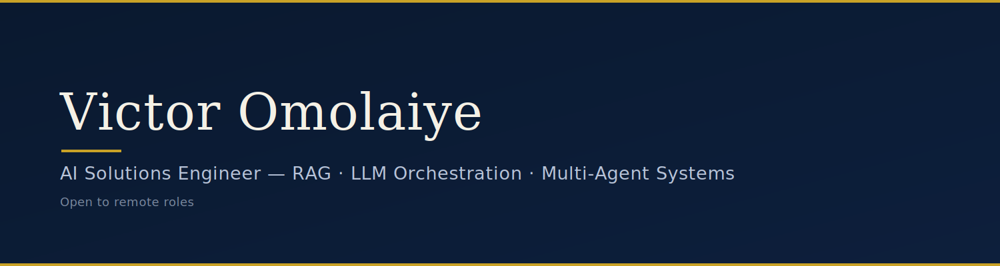

  

  
  
  

  Building production AI systems for public health, NGO/UN, and EdTech — where reliability and privacy matter as much as intelligence.

---

### 🧭 The Sovereign Architect philosophy

I design systems around three constraints: **minimal dependencies**, **privacy by default**, and **first-principles thinking**. In practice, that means offline-capable tools where connectivity can't be guaranteed, deterministic fallbacks where AI shouldn't be the only safety net, and architecture decisions I can defend from first principles — not because a framework made the choice for me.

Co-founder equity in **Algorythyme** and **Pedagic Distribution Nigeria Ltd**. ~1.5 years shipping production AI across Algorythyme, AI4AI, Mensah Philosophic Circle, and Zummit Africa.

---

### 🚀 Featured Work

<table>
<tr>
<td width="50%" valign="top">

**🏥 [Offline CHW Clinical Decision Support Tool](#)**
Gemma 3 1B (Q4_K_M, via llama.cpp) driving a deterministic clinical rule engine for community health workers with no reliable connectivity — with a hard emergency-bypass path so the AI is never the only thing standing between a patient and urgent care.

`Gemma 3` · `llama.cpp` · `Offline-first` · `Deterministic rules`

</td>
<td width="50%" valign="top">

**📊 [DHIS2 Public Health Intelligence Assistant](#)**
FastAPI + LangGraph + pgvector system that turns raw DHIS2 public health data into queryable, multi-modal insight, with dual-mode authentication for institutional deployment.

`FastAPI` · `LangGraph` · `pgvector` · `RAG`

</td>
</tr>
<tr>
<td width="50%" valign="top">

**🛡️ [Gemma Sentinel](#)**
Fine-tuned Gemma deployment for monitoring and inference — small model, tightly scoped, production-hardened.

`Gemma` · `Fine-tuning` · `Inference`

</td>
<td width="50%" valign="top">

**🔌 [IntelliPlug](#)**
LLM-driven logic layered onto hardware control — bringing agentic decision-making to a physical automation project.

`LLM Orchestration` · `Automation`

</td>
</tr>
<tr>
<td width="50%" valign="top">

**📝 [Sovereign Minute Maker](#)**
Lightweight, privacy-first meeting-minutes generator — no data leaves the machine that doesn't need to.

`Privacy-first` · `NLP`

</td>
<td width="50%" valign="top">

**🎯 [Job Market Intelligence Agent](#)**
Agent-based discovery system that surfaces and extracts signal from job market data at scale.

`Multi-agent` · `Data extraction`

</td>
</tr>
</table>

---

### 🛠️ Core Stack

  
  
  
  
  
  
  
  
  

**Focus areas:** Retrieval-augmented generation · Multi-agent orchestration · Model fine-tuning (Gemma, Unsloth) · Offline-first AI deployment · Privacy-preserving system design

---

### 📈 GitHub Stats

  
  

---

### 📫 Let's build something

  <a href="https://iamvictorok.com">iamvictorok.com</a> ·
  <a href="https://linkedin.com/in/victorkola">LinkedIn</a> ·
  <a href="https://github.com/Jovackbud">GitHub</a>

